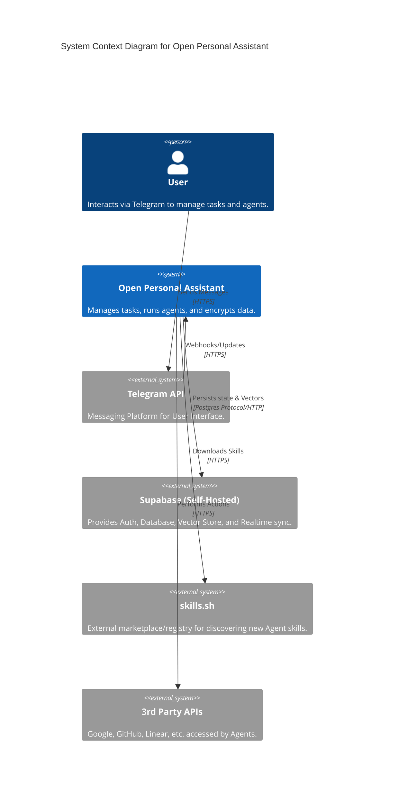
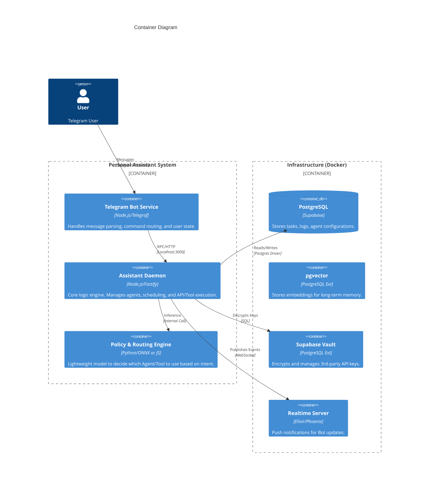
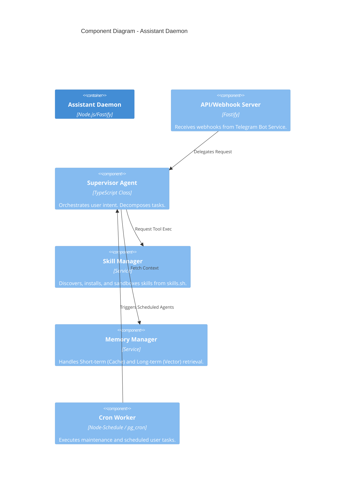
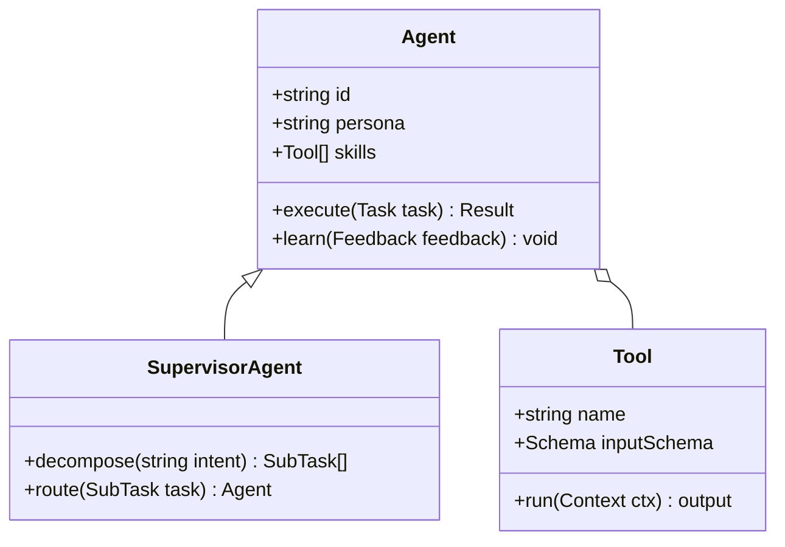

# C4 Architecture Model: Open Personal Assistant

## 1. System Context (Level 1)

**Description:** A privacy-first, cross-platform personal assistant that uses AI agents to manage tasks, schedule events, and perform research, while keeping user data secure and local.

## 2. Container Diagram (Level 2)

**Description:** The high-level deployable units of the architecture.

## 3. Component Diagram (Level 3) - Daemon

**Description:** Internal components of the `Assistant Daemon`.

## 4. Code Diagram (Level 4) - Agent Structure

**Description:** Implementation details of the Agent class.

